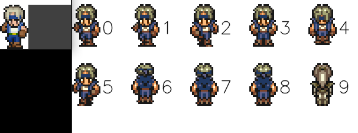
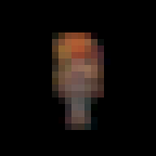
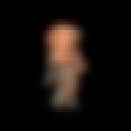
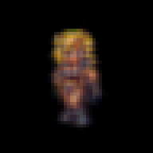

# ChronoTriggerPixelRemaster

This is an attempt to generate a set of sprites that match the theme of the Final Fantasy Pixel Remaster sprites.

Square Enix has released an updated version of the SNES games Final Fantasy 4, 5, and 6 in a format they called the "Pixel Remaster". In this version all of the character sprites have been recolored and themed in a particular art style.

The Pixel Remaster version is on the left of each pairing with the original on the right.

[This page](http://www.videogamesprites.net/) has copies of the original sprites, and the Pixel Remaster sprites can be viewed [here](https://www.spriters-resource.com/pc_computer/)

By cropping and selecting the images to get direct comparisons I could pass them into a Neural Network and train it to produce "Pixel Remaster" versions of SNES sprites.

# Dataset Cleaning and Preparation

## Pixel Remaster Extraction

Extract.py can be used to collect the individual sprites from the sprite sheet, it adds a transparency layer and sets the background to white where there is no foreground.  Then the image is thresholded and cv2.findContours is used to find the individual sprites in the sprite sheet, those cropped sprites are saved out to a "Sprites" folder.

## Original Extraction

SeparateGIF.py can be used to collect the individual sprites from the original sprites saved as .gif files.  This extracts each frame and dumps them into a "Sprites" folder for the original game.

## Manual Cleaning

Images that are not of the same style are removed from the dataset.  This can be done easily by sorting the folders and pruning the largest and smallest sprites because they are either portraits, status effects or map icons that are too small to use.

## Matching Sprites to be used for Comparison

Match.py is used to compare the shape/color of each sprite so we can pair up the original with the remastered counterpart.  Since there are hundreds of sprites per game, getting a match between each sprite requires a lot of comparisons.  All the images of the Remaster images are loaded and compared to each one of the Original images using MSE.  The ten images with the lowest difference will be shown to the screen so the user can select which is the closest Original match to the Remastered sprite.

Match.py outputs a filename pairing between the images.

## Creating a consolidated dataset

PrepData.py takes in the pairings from match.py and generates a consolidated dataset of 48 x 48 pixel sprites with black backgrounds.

# Initial Attempts

## Simple networks

I tried using an autoencoder where the input was the original image and the output was the Pixel Remaster.  The results were at chaotic and splotchy.  I tried adjusting the depth, and size of the hidden layers but nothing I did resulted in improved performance.

Then changed the resnet to a convolutional network with separable layers to try to handle the colors but again the output was blurry no matter how I adjusted the network.

I changed the network to be a modified resnet with very small inputs (since the data is 48x48). The results were better but looked like a blurry version of the input image.  Then I added a custom sharpen layer to the end of the network and that didn't help at all.

## Modified CycleGAN

I knew CycleGAN and StyleGAN could be used to convert from one class to another but I wanted to avoid making a heavily modified version unless I had to.  Since the simpler networks didn't work I tried CycleGAN since it was easier to deal with on smaller images.

CycleGAN is a network structure that is designed to convert from one class to another.  The example normally used is horses and zebras.  The network gets in a large amount of images with horses and a large amount of images with zebras and trains two GANs to generate Horses from the Zebra data and Zebras from the Horse data.  This results in generators that can take images of one type and convert it into the other.

I modified CycleGAN to work with much smaller images than the 300x300 that it is designed for.  This resulted in a smaller network size which I hoped could be trained with the limited number of examples I had but the results were not usable. 

## Heavily modified GAN

CycleGAN gives the ability to convert from class A to class B and from class B back to class A.  Since we don't actually care about the ability to take the Pixel Remaster sprites and convert them back to original SNES style, I simplified the CycleGAN code quite a bit and used a single generator and discriminator to see if it could just go from Original to Remaster.

The results were terrible as well.

## Pair Modified CycleGAN

CycleGAN assumes that the training examples are not directly comparable, but that the training data is large collections that belong to two separate classes.  In the case of horses and zebras this is true, there are no images where we can show two training images where same animal is seen as a horse in one image and a zebra in the other.

But in the case of the Original and Remastered sprites we have pairings that we can use where each class A image can be directly compared against the class B image.  I removed the shuffling from the CycleGAN data preparation so each batch would pass in corresponding images.

This resulted in improved predictions.

# Inspection of the results

## Consistent Character differences

While Ayla and Marle both have their blonde hair darkened, Marle has her pants coloration changed.  This effect is consistent among all sprites of the same character.

Robo and Cyrus come out much brighter and cleaner.

Crono comes out with some color corrections to the hair and clothes

Magus comes out more pale with white hair.

## Localized stability problems

On close inspection one of the adjustements being made to the "Crono Trigger Pixel Remaster" images is flat consistent colors get blended. This makes for smoother details on Ayla's hair or texture on clothing but in the case of Robo or Frog with his sword it becomes obvious that there is some noise being added when the smooth surface gets muddied.
 

# Summary of the Results
 
In most cases the characters are brightened but there are consistent results for each character. Marle has a slight change of color on her pants and darker hair, Ayla has darker hair and darker edges. Crono's hair is slightly more orange and his blue changes slightly. Robo looks much cleaner.

This was made by taking the FF remaster sprites from FF Remaster 4-6 along with the originals and training an AI to learn how to convert from original to the remaster. Then I fed in the CT original images to see how it would generate CT Remaster sprites.
